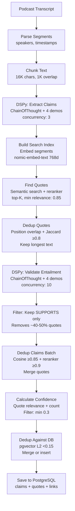

# Claim Extraction System - Quick Overview

## Goal

Extract factual, self-contained claims from podcast transcripts and link them to supporting quotes using DSPy-optimized prompts.

## Architecture



## Models

| Component | Model | Details |
|-----------|-------|---------|
| LLM | `qwen2.5:7b-instruct-q4_0` | Ollama @ localhost:11434 |
| Embeddings | `nomic-embed-text` | 768-dim, Ollama @ localhost:11435 |
| Reranker | Custom service | Cross-encoder @ localhost:8080 |

## DSPy Optimization

### 1. Claim Extraction

```python
class ClaimExtraction(dspy.Signature):
    transcript_chunk: str = dspy.InputField()
    claims: List[str] = dspy.OutputField()
```

- **Optimizer**: `BootstrapFewShot(metric=llm_judge_metric, max_demos=4)`
- **Training**: `evaluation/claims_train.json` (mixed: 369 good + 20 bad examples)
- **Validation**: `evaluation/claims_val.json` (mixed good/bad)
- **Metric**: LLM-as-judge evaluates claim quality (self-contained, specific, factual)
- **Note**: Bad examples teach model to output empty list `claims=[]`
- **Result**: ~60% → ~85% quality score
- **Model**: `models/claim_extractor_llm_judge_v1.json`

### 2. Entailment Validation

```python
class EntailmentValidation(dspy.Signature):
    claim: str = dspy.InputField()
    quote: str = dspy.InputField()
    relationship: Literal["SUPPORTS", "RELATED", "NEUTRAL", "CONTRADICTS"] = dspy.OutputField()
    reasoning: str = dspy.OutputField()
    confidence: float = dspy.OutputField()
```

- **Optimizer**: `BootstrapFewShot(metric=entailment_llm_judge_metric, max_demos=4)`
- **Training**: Mixed examples (`evaluation/entailment_train.json`)
- **Metric**: Heavy penalty for false positives (RELATED classified as SUPPORTS)
- **Result**: 30% → <10% false positive rate
- **Model**: `models/entailment_validator_v1.json`

## Key Pipeline Steps

1. **Parse & Chunk** → 16K chars, 1K overlap
2. **Extract Claims** → DSPy optimized (concurrency: 3)
3. **Find Quotes** → Semantic search + reranker (min relevance: 0.85)
4. **Dedup Quotes** → Position overlap + Jaccard ≥0.8
5. **Validate Entailment** → DSPy optimized, filter to SUPPORTS only (concurrency: 10)
6. **Dedup Claims** → Cosine ≥0.85 + reranker ≥0.9
7. **Score Confidence** → Multi-factor (quote relevance, count)
8. **Database Dedup** → pgvector L2 <0.15
9. **Save** → PostgreSQL

## Key Parameters

```python
# Chunking
chunk_size = 16000
chunk_overlap = 1000

# Concurrency (dspy.asyncify)
max_claim_extraction_concurrency = 3
max_entailment_concurrency = 10

# Deduplication
embedding_similarity_threshold = 0.85  # cosine
reranker_verification_threshold = 0.9
vector_distance_threshold = 0.15       # L2 (pgvector)

# Filtering
min_confidence = 0.3
min_quote_relevance = 0.85
max_quotes_per_claim = 10
```

## Training Commands

```bash
# Train claim extractor
python -m src.training.train_claim_extractor \
  --max-demos 4

# Train entailment validator
python -m src.training.train_entailment_validator \
  --max-demos 4
```

## Database Schema

- **`crypto.claims`**: claim_text, confidence, embedding[768], metadata
- **`crypto.quotes`**: quote_text, start_position, end_position, timestamp_seconds, speaker
- **`crypto.claim_quotes`**: relevance_score, entailment_score, entailment_relationship
